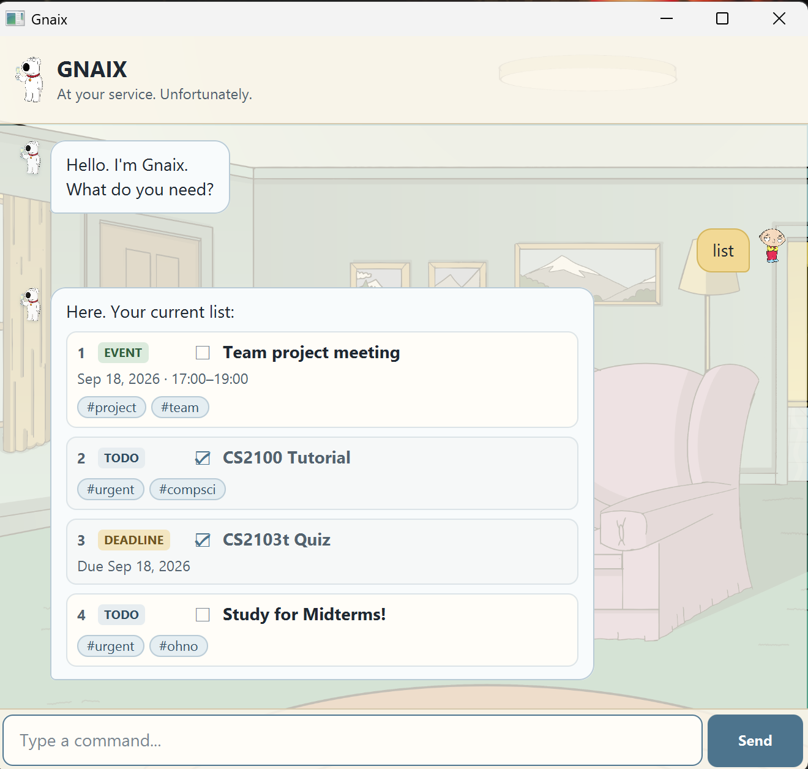

# Gnaix User Guide

Gnaix is a desktop task manager that helps you manage todos, deadlines,
events, and tagged tasks through a simple JavaFX chat-style interface.



## Starting Gnaix

1. Download `gnaix.jar` from the latest GitHub release.
2. Ensure that Java 25 is installed.
3. Open a terminal in the folder containing `gnaix.jar`.
4. Run:

```bash
java -jar gnaix.jar
```

Gnaix stores your tasks automatically and restores them the next time you
start the application from the same location.

## Command summary

| Command | Purpose |
| --- | --- |
| `todo DESCRIPTION` | Add a todo |
| `deadline DESCRIPTION /by DATE` | Add a deadline |
| `event DESCRIPTION /from START /to END` | Add an event |
| `list` | Show all tasks |
| `mark NUMBER` | Mark a task as done |
| `unmark NUMBER` | Mark a task as not done |
| `delete NUMBER` | Delete a task |
| `find KEYWORD` | Find tasks by description |
| `date DATE` | Find deadlines and events occurring on a date |
| `tag #TAG...` | Find tasks containing all specified tags |
| `bye` | Exit Gnaix |

## Adding tasks

### Adding a todo

Use `todo` followed by a description:

```text
todo read lecture notes
```

You can also attach one or more tags:

```text
todo revise chapters #school #urgent
```

### Adding a deadline

Use `deadline` with `/by` followed by a date in `yyyy-MM-dd` format:

```text
deadline submit quiz /by 2026-09-20
```

Tags can be added at the end:

```text
deadline submit project report /by 2026-09-20 #school #urgent
```

### Adding an event

Use `event` with `/from` and `/to` to specify the start and end date and time:

```text
event project meeting /from 2026-09-21 1400 /to 2026-09-21 1530
```

Tags can also be added:

```text
event project meeting /from 2026-09-21 1400 /to 2026-09-21 1530 #school #team
```

## Managing tasks

### Listing tasks

Show all tasks:

```text
list
```

Gnaix displays each task with its task number, completion status, task type,
and any relevant dates, times, or tags.

### Marking a task as done

Use the task number shown by Gnaix:

```text
mark 1
```

### Marking a task as not done

```text
unmark 1
```

### Deleting a task

```text
delete 1
```

Task numbers are one-based and correspond to the numbers shown in the current
task list.

## Searching for tasks

### Searching by keyword

Use `find` to search task descriptions:

```text
find quiz
```

Gnaix displays matching tasks while preserving their original task numbers.

### Searching by date

Use `date` followed by a date in `yyyy-MM-dd` format:

```text
date 2026-09-20
```

Gnaix displays deadlines and events occurring on that date.

## Using tags

Tags help you organise related tasks.

A tag begins with `#` and can be placed at the end of a task command:

```text
todo revise chapters #school
```

Multiple tags are supported:

```text
todo prepare presentation #school #urgent
```

Tags are case-insensitive, and duplicate tags on the same task are stored only
once.

### Searching by one tag

```text
tag #school
```

### Searching by multiple tags

```text
tag #school #urgent
```

When multiple tags are supplied, Gnaix returns only tasks containing **all**
of the specified tags.

For example, `tag #school #urgent` returns a task tagged with both `#school`
and `#urgent`, but not a task containing only `#school`.

## Saving tasks

Gnaix saves your task list automatically whenever it changes.

Your tasks are loaded again when Gnaix starts, so there is no separate save
command.

## Handling errors

If a command is invalid, Gnaix displays an error message instead of terminating
the application.

For example, Gnaix handles:

- unknown commands
- missing task descriptions
- invalid task numbers
- task numbers that do not exist
- malformed dates
- malformed event times
- malformed tags

Read the error message and correct the command before trying again.

## Exiting Gnaix

Enter:

```text
bye
```
You can also close the application window normally.

## Quick start

For a first-time demonstration of Gnaix, try:

```text
todo prepare tutorial worksheet #school #project
deadline submit report /by 2026-09-20 #school #urgent
event team meeting /from 2026-09-18 1400 /to 2026-09-18 1530 #team #project
list
tag #school
```
